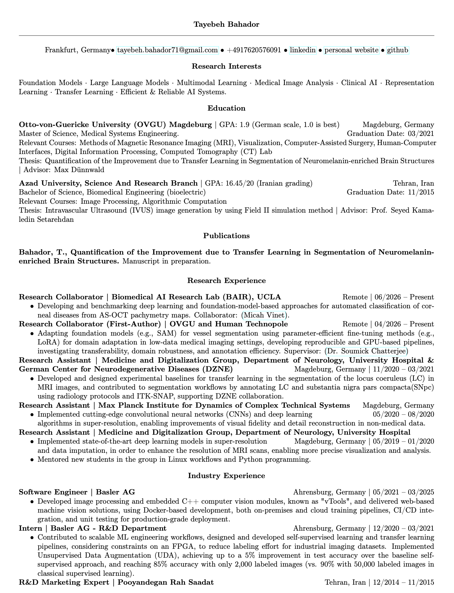
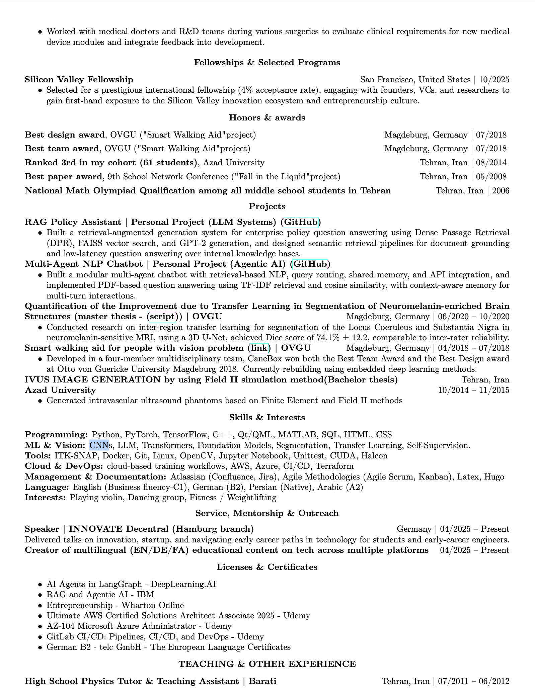

<!--  
Teaching
====== 

  High School Physics Tutor & Teaching Assistant
  Jul 2011 - Jun 2012

• Tutored high school students in physics, reinforcing core concepts and helping improve academic performance.
 • Supported my former teacher post-graduation by reviewing and grading student exam papers.
 • Contributed to the development of his book in physics, by writing detailed example solutions and supporting content.

-->